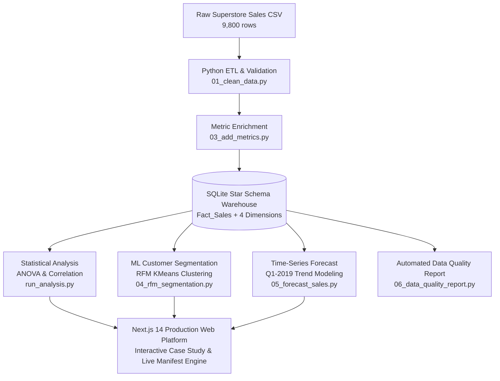

# 🏪 Retail Sales Intelligence & Data Warehouse Platform

[](https://nextjs.org/)
[](https://www.typescriptlang.org/)
[](https://tailwindcss.com/)
[](https://www.python.org/)
[](https://www.sqlite.org/)
[](https://scikit-learn.org/)
[](https://vercel.com/)
[](LICENSE)

An end-to-end **Data Engineering, Statistical Analytics, and Full-Stack Intelligence Platform**.

This project spans the entire data lifecycle: **Raw Transaction Ingestion → Automated ETL Cleaning & Validation → Star-Schema SQLite Warehouse → ANOVA Statistical Hypothesis Testing → Machine Learning RFM Customer Segmentation (K-Means) → Production Interactive Next.js Portfolio & In-Browser CSV Manifest Engine**.

**Project status**

- Stage 1: Data Engineering & Analytics — Completed
- Stage 2: Power BI Interactive Dashboard — In Progress


## 📑 Table of Contents

  - [1. Running the Data Pipeline (Python/SQL)](#1-running-the-data-pipeline-pythonsql)
  - [2. Running the Interactive Web App (Next.js)](#2-running-the-interactive-web-app-nextjs)


## 🔭 Overview

Most portfolio projects demonstrate isolated segments—either just a model, a simple dashboard, or a frontend mockup. **Retail Sales Intelligence** delivers a cohesive, industrial-grade data product:

1. **Automated ETL Pipeline (`pipeline/`):** Cleans messy timestamps, imputes missing geography, standardizes schemas, and enriches data with logistical metrics (*Days to Ship*).
2. **Star-Schema Dimensional Warehouse:** Normalized dimensional model storing 9,800 fact orders with 100% foreign key integrity.
3. **Statistical Hypotheses Testing & ML:** Evaluates logistics impact with one-way ANOVA ($F = 6,950$), proves independence of order value vs. shipping speed ($r = -0.006$), and clusters customers using RFM K-Means ($k=4$, silhouette score = $0.356$).
4. **Interactive Web Application (`web/`):** A custom dark-theme Next.js application featuring animated metric dashboards, Recharts visualizations, and a **client-side in-memory CSV analyzer** that maps, validates, cleans, and runs RFM clustering on custom user manifests.


## 🏛 System Architecture




## 🗄 Data Warehouse & Star Schema

The data warehouse implements a high-performance **Star Schema** in SQLite (`pipeline/sql/schema.sql`), optimized for analytical OLAP queries and multi-table aggregations.

```
                    ┌─────────────────────────┐
                    │        Dim_Date         │
                    │─────────────────────────│
                    │ order_date (PK)         │
                    │ day, month, quarter, yr │
                    └────────────┬────────────┘
                                 │
  ┌─────────────────────────┐    │    ┌─────────────────────────┐
  │      Dim_Customer       │    │    │      Dim_Location       │
  │─────────────────────────│    │    │─────────────────────────│
  │ customer_key (PK)       ├──┐ │ ┌──┤ location_key (PK)       │
  │ customer_id, name, seg  │  │ │ │  │ city, state, postal, reg│
  └─────────────────────────┘  │ │ │  └─────────────────────────┘
                               ▼ ▼ ▼
                    ┌─────────────────────────┐
                    │       Fact_Sales        │
                    │─────────────────────────│
                    │ sale_key (PK)           │
                    │ order_date (FK)         │
                    │ customer_key (FK)       │
                    │ product_key (FK)        │
                    │ location_key (FK)       │
                    │ sales, days_to_ship     │
                    └────────────▲────────────┘
                                 │
                    ┌────────────┴────────────┐
                    │       Dim_Product       │
                    │─────────────────────────│
                    │ product_key (PK)        │
                    │ product_id, name, cat   │
                    └─────────────────────────┘
```

### Table Load & Integrity Counts

| Entity | Table Name | Key Attributes | Row Count |
| :--- | :--- | :--- | :--- |
| **Fact** | `Fact_Sales` | Foreign keys, Sales Amount, Days to Ship | **9,800** |
| **Dimension** | `Dim_Customer` | Customer ID, Customer Name, Segment | **793** |
| **Dimension** | `Dim_Product` | Product ID, Category, Sub-Category, Product Name | **1,861** |
| **Dimension** | `Dim_Location` | Postal Code, City, State, Region | **627** |
| **Dimension** | `Dim_Date` | Order Date, Year, Quarter, Month, Day, Weekday | **1,230** |

> **Integrity Verification:** 100% of fact records resolve across all 4 dimensions in full outer join verification ($9,800 = 9,800$ rows with zero orphan foreign keys).


## 📊 Statistical & Machine Learning Findings

### 1. Delivery Logistics vs. Shipping Mode (ANOVA)

### 2. Order Value vs. Shipping Speed (Correlation)

### 3. Regional Sales Variance (ANOVA)

### 4. RFM Customer Segmentation (K-Means Clustering)
Customers segmented using scaled Recency, Frequency, and Monetary scores ($k=4$, silhouette score = $0.356$):

| Segment | Share (%) | Customer Count | Avg. Spend | Behavioral Profile & Strategy |
| :--- | :--- | :--- | :--- | :--- |
| **High Value** | 7.9% | 63 | $8,521 | Top tier spenders. VIP loyalty incentives & priority support. |
| **Loyal Regulars** | 35.6% | 282 | $3,142 | Consistent repeat buyers. Cross-selling & bundle promotions. |
| **At Risk** | 43.9% | 348 | $1,894 | Mid-to-high past spenders with decaying recency. Re-engagement targets. |
| **New / Low Engagement**| 12.6% | 100 | $612 | Low transaction frequency/value. Onboarding nurture sequences. |


## 💻 Interactive Web Platform (`web/`)

The accompanying Next.js 14 application is not a static text page—it provides an interactive analytics portal:

  - Sticky interactive pipeline stages with smooth viewport observation.
  - Interactive Recharts visualizing ANOVA distributions, star schema relationships, and RFM segment distributions.
  - Responsive retro-modern dark aesthetic built with Tailwind CSS.
  - **100% Client-Side & Private:** Upload any retail CSV file; no data ever leaves the user's browser.
  - **Schema Mapping Wizard:** Auto-detects and maps custom CSV headers to standardized fields (`Order Date`, `Sales Amount`, `Customer ID`, etc.).
  - **In-Memory Data Quality Profiler:** Standardizes date formats, flags missing values, and identifies record anomalies in real-time.
  - **Instant Analytical Engine:** Dynamically renders KPI count-ups, monthly revenue trends, category breakdowns, and runs in-browser K-Means clustering.


## 📁 Repository Structure

```
retail-intelligence-project/
├── .gitignore                      # Monorepo root gitignore
├── README.md                       # Master documentation & guide
│
├── pipeline/                       # Data Engineering & Analytics Pipeline
│   ├── data/
│   │   ├── train.csv               # Raw source transactional data (9,800 rows)
│   │   ├── cleaned_sales.csv       # Standardized & cleaned CSV
│   │   ├── warehouse.db            # SQLite Star Schema Data Warehouse
│   │   └── customer_segments.csv   # RFM clustered customer output
│   ├── scripts/
│   │   ├── 01_clean_data.py        # Ingestion & cleaning script
│   │   ├── 02_build_warehouse.py   # Star schema creation & ETL load
│   │   ├── 03_add_metrics.py       # Days-to-ship logistical metric calculation
│   │   ├── 04_rfm_segmentation.py  # RFM feature engineering & K-Means clustering
│   │   ├── 05_forecast_sales.py    # Time-series trend projection
│   │   ├── 06_data_quality_report.py # Automated QA markdown generator
│   │   └── 07_incremental_load.py  # Idempotent batch delta ingestion demo
│   ├── sql/
│   │   └── schema.sql              # DDL schema definition for Fact & Dim tables
│   ├── r-analysis/
│   │   ├── run_analysis.py         # Statistical analysis suite (ANOVA / correlation)
│   │   └── analysis.R              # Equivalent R statistical implementation
│   └── reports/
│       └── data_quality_report.md  # Generated automated audit report
│
└── web/                            # Next.js 14 Production Web Application
    ├── app/
    │   ├── layout.tsx              # Metadata & root layout
    │   ├── page.tsx                # Portfolio Case Study dashboard
    │   ├── globals.css             # Theme typography & color tokens
    │   ├── components/             # Reusable UI cards, charts, and section blocks
    │   └── analyze/                # In-browser CSV Upload & Analytics engine
    ├── lib/
    │   ├── cleanData.ts            # Client-side data sanitization engine
    │   ├── aggregate.ts            # KPI and time-series aggregation logic
    │   └── rfm.ts                  # In-browser RFM KMeans clustering implementation
    ├── package.json
    ├── tailwind.config.ts
    └── tsconfig.json
```


## 🚀 Quickstart & Local Setup

### Prerequisites

### 1. Running the Data Pipeline (Python/SQL)

```bash
# Navigate to the pipeline directory
cd pipeline

# Install required Python packages
pip install pandas numpy matplotlib scikit-learn scipy

# Execute the complete ETL & Analytics Pipeline
python scripts/01_clean_data.py          # 1. Ingest & clean raw CSV
python scripts/02_build_warehouse.py     # 2. Construct SQLite star schema
python scripts/03_add_metrics.py         # 3. Calculate Days-to-Ship metric
python r-analysis/run_analysis.py        # 4. Run ANOVA & correlation tests
python scripts/04_rfm_segmentation.py    # 5. Execute RFM KMeans clustering
python scripts/05_forecast_sales.py      # 6. Generate Q1 sales forecast
python scripts/06_data_quality_report.py # 7. Generate markdown QA audit
```

### 2. Running the Interactive Web App (Next.js)

```bash
# Navigate to the web application directory
cd web

# Install dependencies
npm install

# Start the Next.js development server
npm run dev
```

Open [http://localhost:3000](http://localhost:3000) in your browser to view the application.


## 🌐 Deployment Guide (Vercel)

The web application is optimized for deployment on Vercel.

### Method 1: Via GitHub & Vercel Dashboard (Recommended)

1. Push your repository to GitHub:
   ```bash
   git add .
   git commit -m "Deploy Retail Intelligence Platform"
   git push origin main
   ```
2. Navigate to [Vercel](https://vercel.com/new) and click **Import** next to this repository.
3. In **Project Configuration**:
   - Set **Root Directory** to `web` *(Click Edit and select the `web` directory)*.
   - Framework Preset will automatically be detected as **Next.js**.
4. Click **Deploy**. Your site will be live within 60 seconds.

### Method 2: Via Vercel CLI

```bash
cd web
npx vercel
# Follow the interactive prompts, then deploy to production:
npx vercel --prod
```


## 📦 Dataset Specifications

The baseline model utilizes the **Superstore Retail Sales** dataset (9,800 transaction records spanning 2015 to 2018):


## 💼 Resume & Skills Mapping

| Engineering Competency | Demonstrated In Codebase |
| :--- | :--- |
| **ETL & Data Pipelines** | Multi-stage Python extraction, imputation, schema coercion, and delta loading ([scripts/](file:///d:/Projects/retail-intelligence-project/pipeline/scripts)). |
| **Data Warehousing (DWH)** | Star schema dimensional modeling, primary/foreign key integrity, SQLite DDL ([schema.sql](file:///d:/Projects/retail-intelligence-project/pipeline/sql/schema.sql)). |
| **Statistical Analysis** | Hypothesis formulation, One-Way ANOVA tests, Pearson correlation analysis ([run_analysis.py](file:///d:/Projects/retail-intelligence-project/pipeline/r-analysis/run_analysis.py)). |
| **Machine Learning** | Feature scaling, RFM scoring, K-Means clustering, silhouette validation ([04_rfm_segmentation.py](file:///d:/Projects/retail-intelligence-project/pipeline/scripts/04_rfm_segmentation.py)). |
| **Full-Stack Data Engineering** | Next.js 14 App Router, TypeScript, in-browser PapaParse parsing, and Recharts ([web/](file:///d:/Projects/retail-intelligence-project/web)). |


